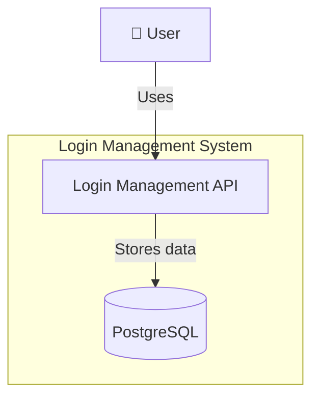
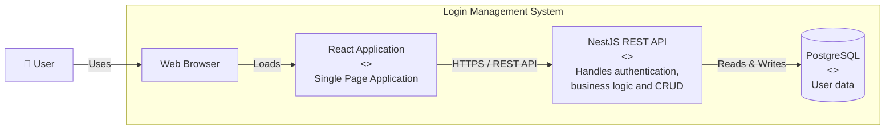

# Basic Login and CRUD Operations

## Introdcution

This is the `Level 0` of the roadmap, and the current branch is `basic-crud-level-0`. The the goal of this level is to build a simple User Management API with authentication while learning the fundamentals of backend development in NestJS, Here, you'll focus on understanding core concepts such as controllers, services, depedency injection, CRUD operations, and how to connect an application to database

## What Problem Will be Solved ?

Applications need a secure way to identify users and control what they are allowed to do. This project solves that problem by providing authentication and basic user mangement

## Who uses it ?

- **Normal users**
  1.  Create an account
  2.  Logs in
  3.  Manages thier own profile

- **Administrator users**
  1. Manages all users
  2. Controls user roles and permissions

## Requirements

- **Authentication**
  1. Login
  2. Password Hashing
  3. JWT authentication

- **User Management**
  - **Nomarl User**
    1. Create an account
    2. View their profile
    3. Updated their own information
    4. Change their password
    5. Soft delete their own account

  - **Adminsitrator**
    1. View all users
    2. Update any user
    3. Delete any user
    4. Promote a user to Administrator

## System Architecture

- **Context**

- **Containers**

- **Components**

[x] The information here is the folders , like for example in back could be, Users and auth

## Goal | Why does it exist ?

Learn how to build a complete backend application and unsderstand the basic concetps of NestsJS before introducing software architecture. By the end of this level, you'll be able to connect a database, build CRUD endpoints, and implement user authentication

## Learning Objectives

1.  TypeScript
2.  Node.js
3.  Express
4.  HTTP
5.  REST
6.  CRUD
7.  Controllers
8.  Services
9.  Repository Pattern
10. TypeORM
11. PostgreSQL
12. DTOs
13. Validation
14. Error Handling
15. JWT
16. Middleware
17. Testing
18. Docker
